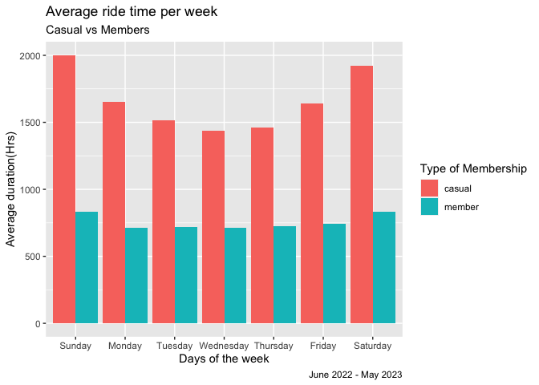
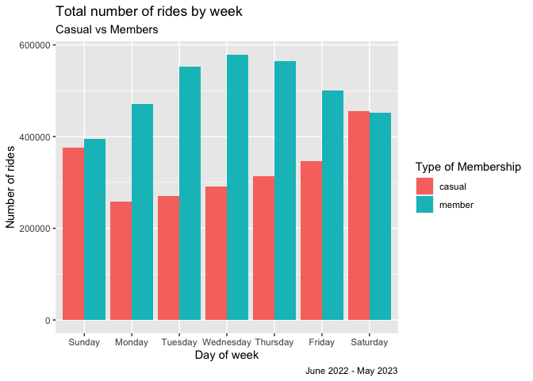
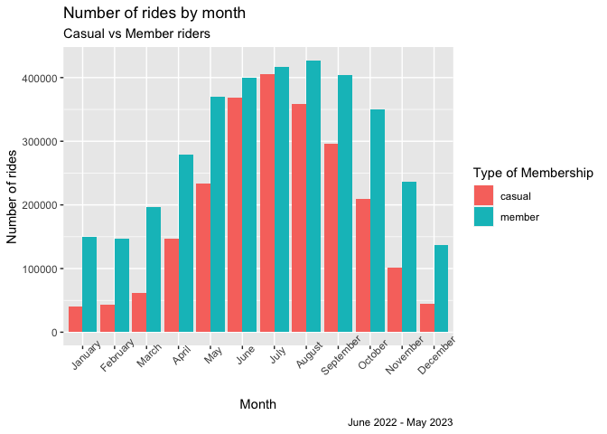
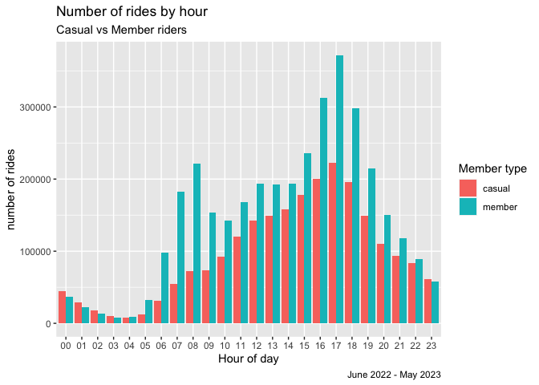
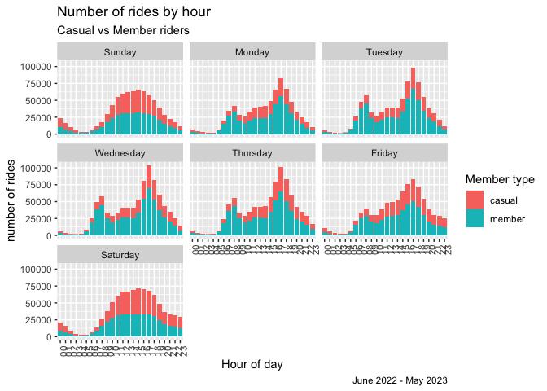
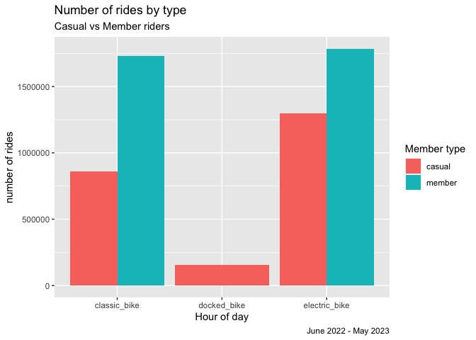

Cyclistic Trip Data Analysis
================
Yamini Kumar
2023-06-20

# Ask

### Cylistic Trip Data Analysis

The goal is to see How annual members & casual riders use cyclistic
bikes differently over the period of last 12 months so that the company
can advise a marketing campaign to target casual riders to convert to
annual riders.

Casual riders are riders with full day pass or single ride pass. Member
riders are riders with annual membership.

# Prepare

### Installing Necessary Packages for data analysis.

``` r
install.packages("tidyverse", repos = "http://cran.us.r-project.org")
```

    ## 
    ## The downloaded binary packages are in
    ##  /var/folders/gp/tdr2hgwn50d6lwfzj1lgv8nr0000gp/T//Rtmpaolccx/downloaded_packages

``` r
install.packages("janitor", repos = "http://cran.us.r-project.org")
```

    ## 
    ## The downloaded binary packages are in
    ##  /var/folders/gp/tdr2hgwn50d6lwfzj1lgv8nr0000gp/T//Rtmpaolccx/downloaded_packages

``` r
install.packages("reshape", repos = "http://cran.us.r-project.org")
```

    ## 
    ## The downloaded binary packages are in
    ##  /var/folders/gp/tdr2hgwn50d6lwfzj1lgv8nr0000gp/T//Rtmpaolccx/downloaded_packages

### Loading installed packages

We will need to load the packages that comes with the tidyverse package
to use some of the functions that come along with these packages for our
data analysis.

``` r
library(tidyverse)
```

    ## ── Attaching core tidyverse packages ──────────────────────── tidyverse 2.0.0 ──
    ## ✔ dplyr     1.1.2     ✔ readr     2.1.4
    ## ✔ forcats   1.0.0     ✔ stringr   1.5.0
    ## ✔ ggplot2   3.4.2     ✔ tibble    3.2.1
    ## ✔ lubridate 1.9.2     ✔ tidyr     1.3.0
    ## ✔ purrr     1.0.1     
    ## ── Conflicts ────────────────────────────────────────── tidyverse_conflicts() ──
    ## ✖ dplyr::filter() masks stats::filter()
    ## ✖ dplyr::lag()    masks stats::lag()
    ## ℹ Use the conflicted package (<http://conflicted.r-lib.org/>) to force all conflicts to become errors

``` r
library(dplyr)
library(lubridate)
library(ggplot2)
library(janitor)
```

    ## 
    ## Attaching package: 'janitor'
    ## 
    ## The following objects are masked from 'package:stats':
    ## 
    ##     chisq.test, fisher.test

``` r
library(reshape)
```

    ## 
    ## Attaching package: 'reshape'
    ## 
    ## The following object is masked from 'package:lubridate':
    ## 
    ##     stamp
    ## 
    ## The following object is masked from 'package:dplyr':
    ## 
    ##     rename
    ## 
    ## The following objects are masked from 'package:tidyr':
    ## 
    ##     expand, smiths

### Loading the data in variable names

This is a public data and has been made available by Motivate
International Inc. under this
[license](https://ride.divvybikes.com/data-license-agreement). The data
can be accessed
[here](https://divvy-tripdata.s3.amazonaws.com/index.html). The data is
in csv files and they are arranged by monthy files. We have loaded last
12 months of data in seperate variable names by month. Because of the
large size of data we will be using R studio to perform our analysis.

``` r
cyclistic_trip_data_202206 <- read.csv("/Users/yaminipkumar/Desktop/Google-Data-Analytics/8-Case-Study-Capstone/Track1 Capstone Project/202206-divvy-tripdata.csv")

cyclistic_trip_data_202207 <- read.csv("/Users/yaminipkumar/Desktop/Google-Data-Analytics/8-Case-Study-Capstone/Track1 Capstone Project/202207-divvy-tripdata.csv")

cyclistic_trip_data_202208 <- read.csv("/Users/yaminipkumar/Desktop/Google-Data-Analytics/8-Case-Study-Capstone/Track1 Capstone Project/202208-divvy-tripdata.csv")

cyclistic_trip_data_202209 <- read.csv("/Users/yaminipkumar/Desktop/Google-Data-Analytics/8-Case-Study-Capstone/Track1 Capstone Project/202209-divvy-publictripdata.csv")

cyclistic_trip_data_202210 <- read.csv("/Users/yaminipkumar/Desktop/Google-Data-Analytics/8-Case-Study-Capstone/Track1 Capstone Project/202210-divvy-tripdata.csv")

cyclistic_trip_data_202211 <- read.csv("/Users/yaminipkumar/Desktop/Google-Data-Analytics/8-Case-Study-Capstone/Track1 Capstone Project/202211-divvy-tripdata.csv")

cyclistic_trip_data_202212 <- read.csv("/Users/yaminipkumar/Desktop/Google-Data-Analytics/8-Case-Study-Capstone/Track1 Capstone Project/202212-divvy-tripdata.csv")

cyclistic_trip_data_202301 <- read.csv("/Users/yaminipkumar/Desktop/Google-Data-Analytics/8-Case-Study-Capstone/Track1 Capstone Project/202301-divvy-tripdata.csv")

cyclistic_trip_data_202302 <- read.csv("/Users/yaminipkumar/Desktop/Google-Data-Analytics/8-Case-Study-Capstone/Track1 Capstone Project/202302-divvy-tripdata.csv")

cyclistic_trip_data_202303 <- read.csv("/Users/yaminipkumar/Desktop/Google-Data-Analytics/8-Case-Study-Capstone/Track1 Capstone Project/202303-divvy-tripdata.csv")

cyclistic_trip_data_202304 <- read.csv("/Users/yaminipkumar/Desktop/Google-Data-Analytics/8-Case-Study-Capstone/Track1 Capstone Project/202304-divvy-tripdata.csv")

cyclistic_trip_data_202305 <- read.csv("/Users/yaminipkumar/Desktop/Google-Data-Analytics/8-Case-Study-Capstone/Track1 Capstone Project/202305-divvy-tripdata.csv")
```

### Combining data

Below we are combining data for all the 12 months so that we can spot
trends for the last 12 months and storing it in a variable name
cyclistic_trip_data.

``` r
cyclistic_trip_data <- rbind(cyclistic_trip_data_202206, cyclistic_trip_data_202207, cyclistic_trip_data_202208, cyclistic_trip_data_202209, cyclistic_trip_data_202210, cyclistic_trip_data_202211, cyclistic_trip_data_202212, cyclistic_trip_data_202301, cyclistic_trip_data_202302, cyclistic_trip_data_202303, cyclistic_trip_data_202304, cyclistic_trip_data_202305)
```

### Viewing data

Now that our data is combined lets view the data to see if the data has
been combined correctly.

``` r
head(cyclistic_trip_data)
```

    ##            ride_id rideable_type          started_at            ended_at
    ## 1 600CFD130D0FD2A4 electric_bike 2022-06-30 17:27:53 2022-06-30 17:35:15
    ## 2 F5E6B5C1682C6464 electric_bike 2022-06-30 18:39:52 2022-06-30 18:47:28
    ## 3 B6EB6D27BAD771D2 electric_bike 2022-06-30 11:49:25 2022-06-30 12:02:54
    ## 4 C9C320375DE1D5C6 electric_bike 2022-06-30 11:15:25 2022-06-30 11:19:43
    ## 5 56C055851023BE98 electric_bike 2022-06-29 23:36:50 2022-06-29 23:45:17
    ## 6 B664188E8163D045 electric_bike 2022-06-30 16:42:10 2022-06-30 16:58:22
    ##   start_station_name start_station_id end_station_name end_station_id start_lat
    ## 1                                                                         41.89
    ## 2                                                                         41.91
    ## 3                                                                         41.91
    ## 4                                                                         41.80
    ## 5                                                                         41.91
    ## 6                                                                         42.03
    ##   start_lng end_lat end_lng member_casual
    ## 1    -87.62   41.91  -87.62        casual
    ## 2    -87.62   41.93  -87.63        casual
    ## 3    -87.65   41.89  -87.61        casual
    ## 4    -87.66   41.80  -87.65        casual
    ## 5    -87.63   41.93  -87.64        casual
    ## 6    -87.71   42.06  -87.73        casual

Observations:

- Few columns have empty cells
- The start date and end date are in character format.
- We have several columns that we will not be using for this analysis.

### Removing columns that we will not need for this analysis

``` r
cyclistic_trip_data <- cyclistic_trip_data %>%  
  select(-c(ride_id, start_lat, start_lng, end_lat, end_lng, start_station_id,end_station_id))
```

### Replacing blank cells with NA

``` r
cyclistic_trip_data[cyclistic_trip_data == ""] <- NA
```

### Checking if the data was combined correctly for the last 12 months

Here we are checking the minimum starting_date and maximum starting date
to see if data for the last 12 months was combined correctly. Below we
have used as_date function to cast starting_date field as date since it
is stored as character in the data frame. We have checked this above by
running the glimpse function.

``` r
min(as_date(cyclistic_trip_data$started_at), na.rm = TRUE)
```

    ## [1] "2022-06-01"

``` r
max(as_date(cyclistic_trip_data$started_at), na.rm = TRUE)
```

    ## [1] "2023-05-31"

The min date should be “2022-06-01” and the max date should be
“2023-05-31”. This would mean that the 12 month data has been imported
correctly in the dataframe.

### Checking values stored in ride type and member type

``` r
unique(cyclistic_trip_data$rideable_type)
```

    ## [1] "electric_bike" "classic_bike"  "docked_bike"

``` r
unique(cyclistic_trip_data$member_casual)
```

    ## [1] "casual" "member"

We can see that there are three types of ride type - electric, classic
and docked.

Also, there are two types of riders - member and casual.

This also confirms that there are no blanks in both the fields.

# Process

In this phase, we will be creating additional columns that we will need
to further analyse the data. We will also we converting data types for
calculations for some columns.

### Extracting day of week, month and hour from start date in seperate columns

``` r
cyclistic_trip_data <- cyclistic_trip_data %>%
mutate(day_of_week = wday(started_at, label = TRUE, abbr = FALSE), month = month(started_at, label = TRUE, abbr = FALSE), hour = strftime(started_at, "%H"))
head(cyclistic_trip_data)
```

    ##   rideable_type          started_at            ended_at start_station_name
    ## 1 electric_bike 2022-06-30 17:27:53 2022-06-30 17:35:15               <NA>
    ## 2 electric_bike 2022-06-30 18:39:52 2022-06-30 18:47:28               <NA>
    ## 3 electric_bike 2022-06-30 11:49:25 2022-06-30 12:02:54               <NA>
    ## 4 electric_bike 2022-06-30 11:15:25 2022-06-30 11:19:43               <NA>
    ## 5 electric_bike 2022-06-29 23:36:50 2022-06-29 23:45:17               <NA>
    ## 6 electric_bike 2022-06-30 16:42:10 2022-06-30 16:58:22               <NA>
    ##   end_station_name member_casual day_of_week month hour
    ## 1             <NA>        casual    Thursday  June   17
    ## 2             <NA>        casual    Thursday  June   18
    ## 3             <NA>        casual    Thursday  June   11
    ## 4             <NA>        casual    Thursday  June   11
    ## 5             <NA>        casual   Wednesday  June   23
    ## 6             <NA>        casual    Thursday  June   16

### Converting start date and end date into date time format as we observed that date time is currently in character format

``` r
cyclistic_trip_data$started_at <- ymd_hms(cyclistic_trip_data$started_at)
cyclistic_trip_data$ended_at <- ymd_hms(cyclistic_trip_data$ended_at)
```

### Calculating ride length by substracting end date from start date

``` r
cyclistic_trip_data$ride_length <- difftime(cyclistic_trip_data$ended_at, cyclistic_trip_data$started_at)
```

### Converting the result in numeric format for doing further calculations and analysis

``` r
cyclistic_trip_data$ride_length <- as.numeric(cyclistic_trip_data$ride_length)
```

Removing ride length entries less than 0 because ended time cannot be
greater than start time. We will also we removing entries with 0
seconds.

``` r
cyclistic_trip_data <- filter(cyclistic_trip_data, ride_length > 0)
```

We have three new columns in our data frame cyclistic_trip_data. We can
view below:

``` r
head(cyclistic_trip_data)
```

    ##   rideable_type          started_at            ended_at start_station_name
    ## 1 electric_bike 2022-06-30 17:27:53 2022-06-30 17:35:15               <NA>
    ## 2 electric_bike 2022-06-30 18:39:52 2022-06-30 18:47:28               <NA>
    ## 3 electric_bike 2022-06-30 11:49:25 2022-06-30 12:02:54               <NA>
    ## 4 electric_bike 2022-06-30 11:15:25 2022-06-30 11:19:43               <NA>
    ## 5 electric_bike 2022-06-29 23:36:50 2022-06-29 23:45:17               <NA>
    ## 6 electric_bike 2022-06-30 16:42:10 2022-06-30 16:58:22               <NA>
    ##   end_station_name member_casual day_of_week month hour ride_length
    ## 1             <NA>        casual    Thursday  June   17         442
    ## 2             <NA>        casual    Thursday  June   18         456
    ## 3             <NA>        casual    Thursday  June   11         809
    ## 4             <NA>        casual    Thursday  June   11         258
    ## 5             <NA>        casual   Wednesday  June   23         507
    ## 6             <NA>        casual    Thursday  June   16         972

# Analysis

### Calculating mean, max, and mode of ride_length for analysis

``` r
mean(cyclistic_trip_data$ride_length, na.rm = TRUE)
```

    ## [1] 1122.857

``` r
min(cyclistic_trip_data$ride_length, na.rm = TRUE)
```

    ## [1] 1

``` r
max(cyclistic_trip_data$ride_length, na.rm = TRUE)
```

    ## [1] 2483235

``` r
# Create the function for mode
getmode <- function(v) {
   uniqv <- unique(v)
   uniqv[which.max(tabulate(match(v, uniqv)))]
}
# calculate mode
getmode(cyclistic_trip_data$day_of_week)
```

    ## [1] Saturday
    ## 7 Levels: Sunday < Monday < Tuesday < Wednesday < Thursday < ... < Saturday

Here we can see the average ride time, min ride time, max ride time
respectively. Also, we can see that “Saturday” is the most popular day
of week.

### Calculating mode for member and casual riders

``` r
cyclistic_trip_data %>%
  group_by(member_casual) %>%
  summarize(mode_day_of_week = getmode(day_of_week))
```

    ## # A tibble: 2 × 2
    ##   member_casual mode_day_of_week
    ##   <chr>         <ord>           
    ## 1 casual        Saturday        
    ## 2 member        Wednesday

Here we can observe that most common day of week for casual riders is
Saturday while that of member riders is Wednesday. By this we can assume
that casual riders prefer weekends while member riders prefer weekdays.
Hwever, we will need to perform further analysis to confimr this
hypothesis.

### Average ride length for casual and members riders

``` r
cyclistic_trip_data %>%
  group_by(member_casual) %>%
  summarize(average_ride_length = mean(ride_length))
```

    ## # A tibble: 2 × 2
    ##   member_casual average_ride_length
    ##   <chr>                       <dbl>
    ## 1 casual                      1693.
    ## 2 member                       748.

Here we can see that casual members have greater average ride length
than members. This means that casual riders ride for longer time period
than member riders.

### Average ride length for casual and member riders by week

``` r
weekly_average_ride_length <- cyclistic_trip_data %>%
  group_by(member_casual, day_of_week) %>%
  summarize(average_ride_length = mean(ride_length), .groups = "drop")
cast(weekly_average_ride_length, day_of_week ~ member_casual)
```

    ## Using average_ride_length as value column.  Use the value argument to cast to override this choice

    ##   day_of_week   casual   member
    ## 1      Sunday 2002.736 830.9489
    ## 2      Monday 1653.502 710.8147
    ## 3     Tuesday 1517.044 718.9393
    ## 4   Wednesday 1436.635 714.8681
    ## 5    Thursday 1462.334 722.0067
    ## 6      Friday 1641.767 740.6443
    ## 7    Saturday 1924.873 834.7959

Here we immediately notice that casual riders have almost double average
ride time than member riders. For further analysis we will make a graph.

# Visualization

### Visualizing average ride length for casual and member rides by week

``` r
cyclistic_trip_data %>%  
  group_by(member_casual, day_of_week) %>% 
  summarise(average_ride_length = mean(ride_length), .groups="drop") %>%
  ggplot(aes(x = day_of_week, y = average_ride_length, fill = member_casual)) +
  geom_col(position = "dodge") +
  labs(x = "Days of the week", y = "Average duration(Hrs)", title =
         "Average ride time per week", subtitle = "Casual vs Members",  fill = "Type of Membership", caption = "June 2022 - May 2023")
```

<!-- -->

We can confirm that average ride length of casual riders is more than
double as compared to member riders. We can also notice significant
increase in average ride time for casual riders on weekends while there
is only a slight increase in member riders average ride time for the
weekend. Member riders are almost consistent on weekday and weekends.

### Number of ride for casual and member riders by day of week

``` r
weekly_number_ride_length <- cyclistic_trip_data %>%
  group_by(member_casual, day_of_week) %>%
  summarize(number_of_rides = n())
```

    ## `summarise()` has grouped output by 'member_casual'. You can override using the
    ## `.groups` argument.

``` r
cast(weekly_number_ride_length, day_of_week ~ member_casual)
```

    ## Using number_of_rides as value column.  Use the value argument to cast to override this choice

    ##   day_of_week casual member
    ## 1      Sunday 375582 394506
    ## 2      Monday 257799 471362
    ## 3     Tuesday 270936 552484
    ## 4   Wednesday 291886 579298
    ## 5    Thursday 313310 564862
    ## 6      Friday 346524 501423
    ## 7    Saturday 455777 452714

Here will compare the number of rides both casual and members take on
weekly basis. We can see that number of rides progresses for casual
members as weekend approaches and is the highest on weekends. However,
number of rides for member decreases as weekend approaches. Let’s
visualize this to confirm our hypothesis.

### Visualizing number of rides by casual and member riders

``` r
cyclistic_trip_data %>%
  group_by(member_casual, day_of_week) %>%
  summarize(number_of_rides = n(), .groups = "drop") %>% 
  arrange(day_of_week, member_casual) %>%
  ggplot(aes(x = day_of_week, y = number_of_rides, fill = member_casual)) + geom_col(position = "dodge") + scale_y_continuous(labels = function(x) format(x, scientific = FALSE)) + labs(x = "Day of week", y = "Number of rides", title = "Total number of rides by week", subtitle = "Casual vs Members", fill = "Type of Membership", caption = "June 2022 - May 2023")
```

<!-- -->

By visualizing we can see that members use rides for daily commutes as
we can see rise in number of rides on weekdays. While, casual members
use rides for leisure as we cam see rise in number of casual riders on
weekends.

### Visualizing monthly number of rides by causual and member riders

``` r
cyclistic_trip_data %>%
  group_by(member_casual, month) %>%
  summarize(number_of_rides = n()) %>%
  arrange(member_casual, month) %>%
  ggplot(aes(x = month, y = number_of_rides, fill = member_casual)) + geom_col(position = "dodge") + theme(axis.text.x = element_text(angle = 45)) + labs(x = "Month", y = "Number of rides", title = "Number of rides by month", subtitle = "Casual vs Member riders", caption = "June 2022 - May 2023", fill = "Type of Membership") + scale_y_continuous(labels = function(x) format(x, scientific = FALSE))
```

    ## `summarise()` has grouped output by 'member_casual'. You can override using the
    ## `.groups` argument.

<!-- -->

We can confirm an increase in number of riders for both casual and
member riders in hotter months as compared to cooler months. Proving our
point that demand for bikes are highest in summers.

### Visualizing number of rides by hour for member and casual riders

Let’s visualize number of bike rides by day

``` r
cyclistic_trip_data %>%
  ggplot(aes(x = hour, fill = member_casual)) + geom_bar(position = "dodge") + labs(x = "Hour of day", y = "number of rides", title = "Number of rides by hour", subtitle = "Casual vs Member riders", caption = "June 2022 - May 2023", fill = "Member type") + scale_y_continuous(labels = function(x) format(x, scientific = FALSE))
```

<!-- -->

We can see that for casual riders the there is a rise in number of rides
from 7 am till 3 pm. However, member ride times have peak between 12pm
to 2pm and there is also a peak between 3 am to 4am which can signify
that some member riders start there day early for commute than casual
riders. We can conclude that most rides are taken in the afternoon.

### Number of rides by day of hour all over the week

Now lets observe how a typical day of week would look like for both
riders by hour of day

``` r
cyclistic_trip_data %>%
  ggplot(aes(x = hour, fill = member_casual)) + geom_bar() + labs(x = "Hour of day", y = "number of rides", title = "Number of rides by hour", subtitle = "Casual vs Member riders", caption = "June 2022 - May 2023", fill = "Member type") + theme(axis.text.x = element_text(angle = 90)) + scale_y_continuous(labels = function(x) format(x, scientific = FALSE)) + facet_wrap(~ day_of_week)
```

<!-- -->

We can see a pattern for weekday and weekend. Weekend has peak between
morning to evening for both member and casual riders while weekdays
members have a peak between early mornings and afternoons. Which means
that early morning commutes between 3am to 4pm are common for member
riders on a typical weekday and major peak for both riders is in
afternoon. Also, weekend for both the riders look same with peak
starting from late mornings to early evenings.

### Most popular bike type

``` r
cyclistic_trip_data %>%
  ggplot(aes(x = rideable_type, fill = member_casual)) + geom_bar(position = "dodge") + labs(x = "Hour of day", y = "number of rides", title = "Number of rides by type", subtitle = "Casual vs Member riders", caption = "June 2022 - May 2023", fill = "Member type") 
```

<!-- -->

We can see that member riders prefer electric bike and classic bikes
respectively followed by docked bikes. The docked bikes are least
favourite type. Casual members prefer electric bikes follwed by classic
bikes. Electric bikes are the most favourable type of bike among both
riders.

### Calculating top 10 departure stations for casual riders

``` r
cyclistic_trip_data <- na.omit(cyclistic_trip_data)
top_ten_station_names <- cyclistic_trip_data %>%
  group_by(member_casual) %>%
  count(start_station_name) %>%
  filter(member_casual == "casual") %>%
  arrange(-n)
head(top_ten_station_names, 10)
```

    ## # A tibble: 10 × 3
    ## # Groups:   member_casual [1]
    ##    member_casual start_station_name                     n
    ##    <chr>         <chr>                              <int>
    ##  1 casual        Streeter Dr & Grand Ave            52618
    ##  2 casual        DuSable Lake Shore Dr & Monroe St  29958
    ##  3 casual        Michigan Ave & Oak St              23180
    ##  4 casual        Millennium Park                    23030
    ##  5 casual        DuSable Lake Shore Dr & North Blvd 21483
    ##  6 casual        Shedd Aquarium                     18988
    ##  7 casual        Theater on the Lake                16885
    ##  8 casual        Wells St & Concord Ln              14385
    ##  9 casual        Dusable Harbor                     13345
    ## 10 casual        Indiana Ave & Roosevelt Rd         12626

### Calculating top 10 arrival stations for casual riders

``` r
cyclistic_trip_data <- na.omit(cyclistic_trip_data)
top_ten_station_names <- cyclistic_trip_data %>%
  group_by(member_casual) %>%
  count(end_station_name) %>%
  filter(member_casual == "casual") %>%
  arrange(-n)
head(top_ten_station_names, 10)
```

    ## # A tibble: 10 × 3
    ## # Groups:   member_casual [1]
    ##    member_casual end_station_name                       n
    ##    <chr>         <chr>                              <int>
    ##  1 casual        Streeter Dr & Grand Ave            55901
    ##  2 casual        DuSable Lake Shore Dr & Monroe St  27821
    ##  3 casual        Millennium Park                    25131
    ##  4 casual        Michigan Ave & Oak St              24720
    ##  5 casual        DuSable Lake Shore Dr & North Blvd 24499
    ##  6 casual        Theater on the Lake                18192
    ##  7 casual        Shedd Aquarium                     17235
    ##  8 casual        Wells St & Concord Ln              13981
    ##  9 casual        Dusable Harbor                     12685
    ## 10 casual        Clark St & Armitage Ave            12620

We have identified top 10 departure and arrival stations for casual
memebers. We can use this data for maketing pamplets at these stations
for membership convertion.

# Key takeaways

- Casual riders ride almost double the length as to member riders.
- Casual riders prefer to ride on weekends probably for leisure and
  member riders ride for daily commute from monday to friday.\*
- Number of rides for both casual and member riders increase in summer
  time making winter the least favorite season for riders.
- The peak time for both member and casual riders is in the afternoon.
- Weekend peak time starts from morning to early evening for both
  riders.
- Electric bikes are preferred by both casual and members than any other
  bike type.

# Recommendations

- In addition to single ride and full day passes a weekend membership
  pass with lower price point can be introduced to convert casual riders
  into members.
- Also, we can offer discounts on new membership right before summer
  starts as we can see that most rides are in summer season.
- We can distribute pamplets or stick posters with the weekend
  membership plans and discounts on yearly membership on the identified
  top 10 departure and arrival stations for casual riders to catch there
  eyes.
- We could further conduct a survey to know the availability of bike
  types preferred by casual riders. This could give us more insight on
  whether increasing electric bike type would help us in member
  conversion or not as increasing bike type would mean capital
  investment.

# Limitations

- Since all ride id’s are different we cannot conclude if a rider takes
  more than one ride.
- More data like price points could help us optimize the cost structure
  of membership plans
- Gender information could further help us evaluate which type of gender
  prefers to ride more and age factor would also help us identify the
  age groups who ride bikes for a more filtered marketing scheme.
